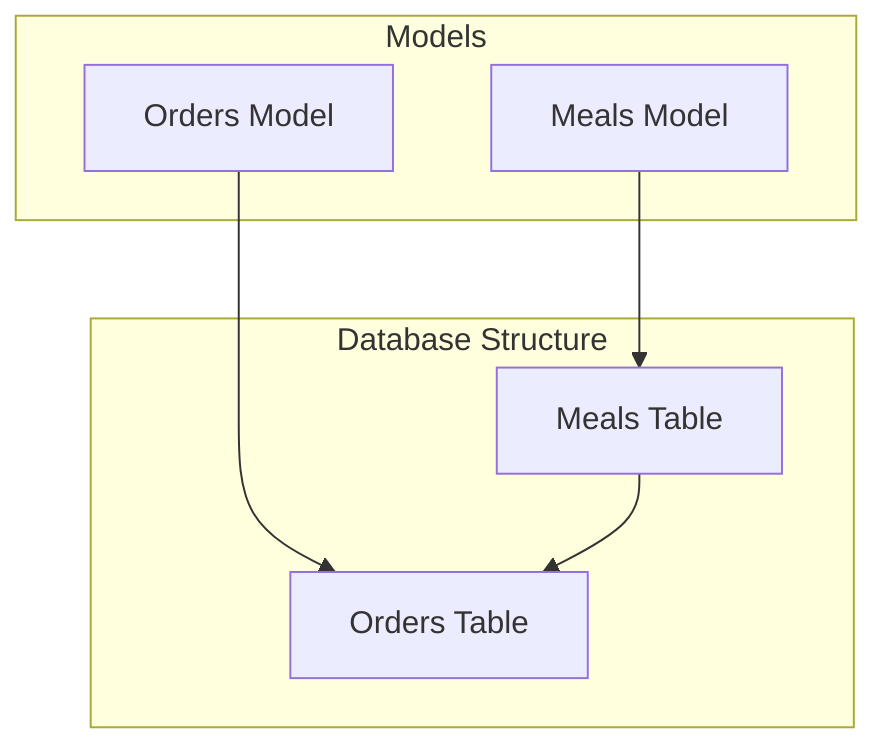
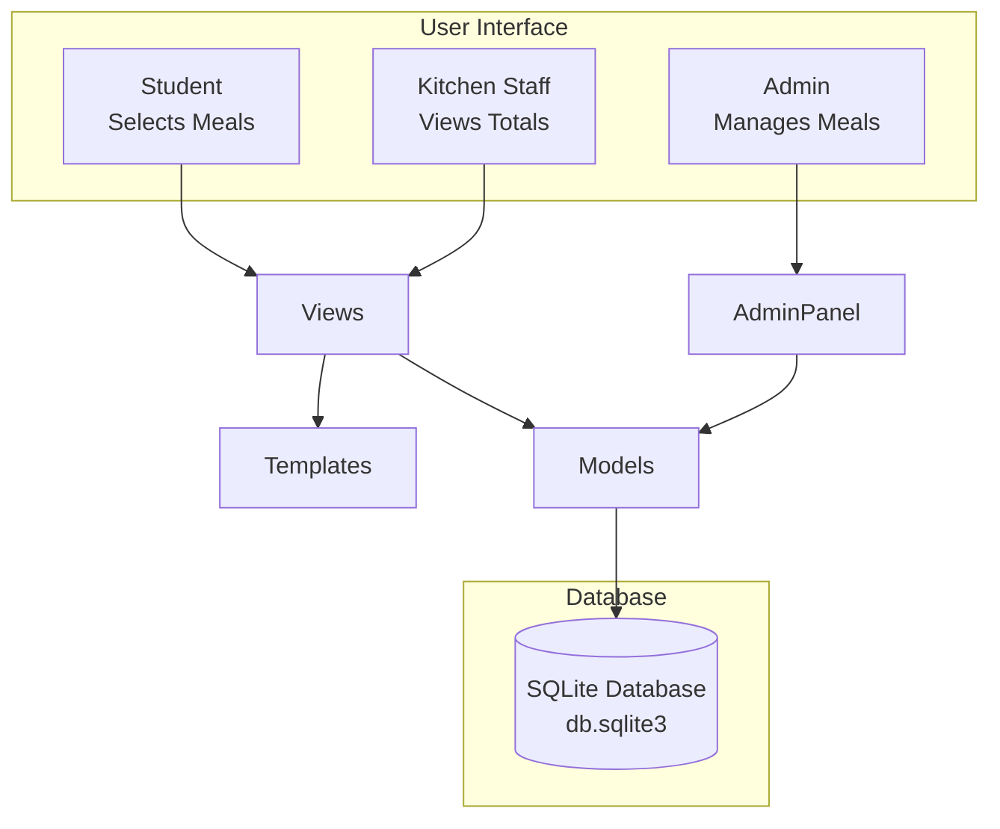
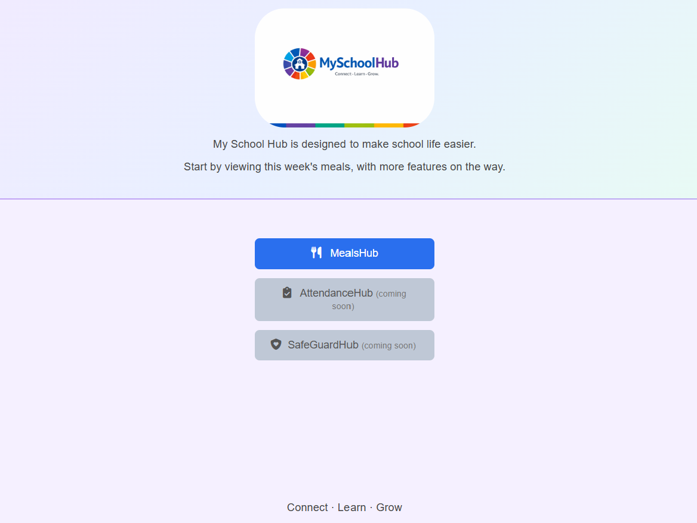
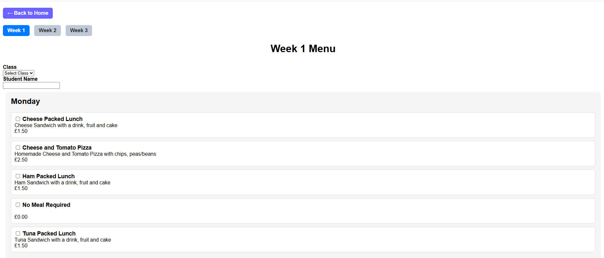
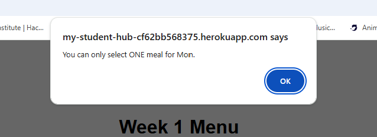
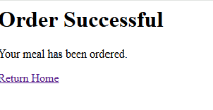
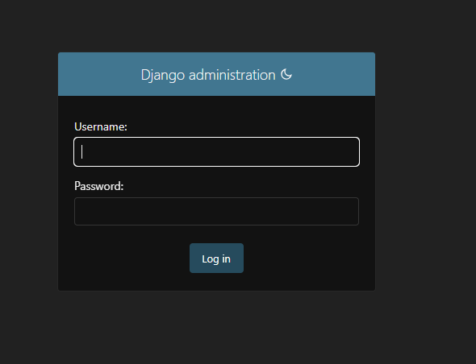
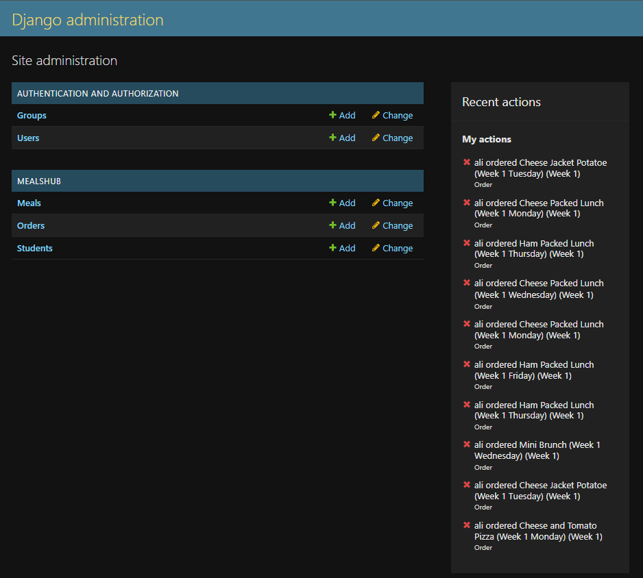
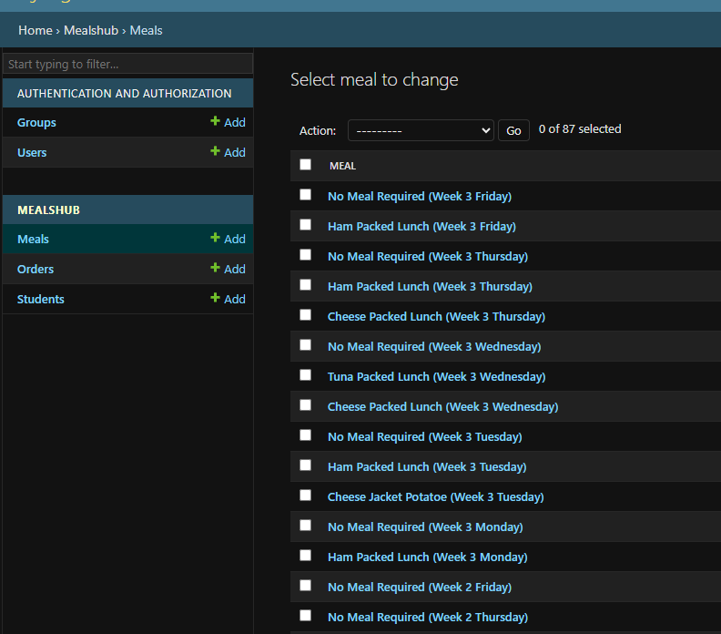
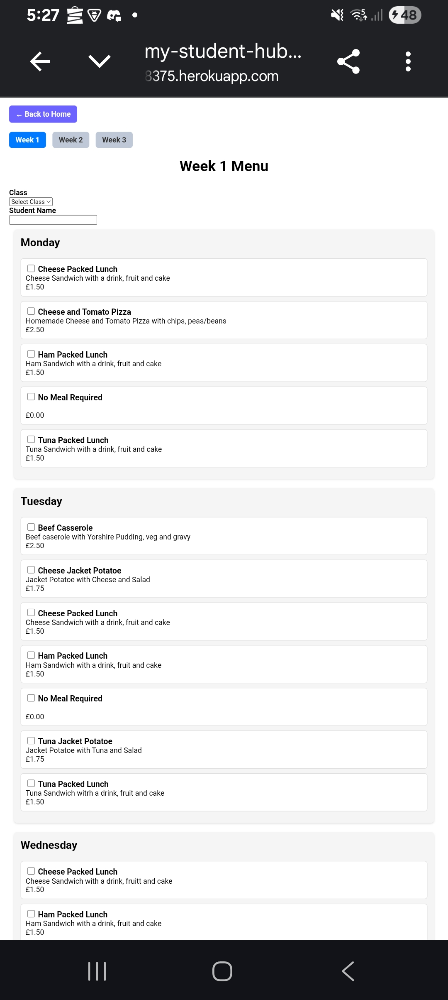

# MySchoolHub - MealsHub Module


# 🏫 Overview


MySchoolHub is the first module of the **MySchoolHub** platform - a simple, school-friendly system that allows students (or parents) to select meals for the school week.  
It replaces manual paper-based meal choices with a clean digital workflow that reduces admin time, improves accuracy, and helps kitchen staff plan more efficiently.

Students can select thier meals for the week, while kitchen staff receive accurate daily totals broken down by meal type. This reduces manual counting, minimises food waste, and supports smoother kitchen planning.

Although this project focuses on the MealsHub module, MySchoolHub is intentionally designed to be scalable. Future modules may include attendance tracking, communication tools, and a safeguarding system similar to CPOMS (SafeGuardHub). This modular approach ensures the platform can grow over time while keeping each section focused and manageable.

---

# 🎯 Project Rationale
Many schools still rely on manual processes for collecting meal choices, which can lead to errors, delays, and unnecessary food waste. With meals priced individually, accuracy becomes even more important - incorrect orders can lead to financial discrepancies as well as wasted food. Mealshub provides a simple digital solution that:

- Gives students an easy way to choose meals

- Ensures accurate meal counts for kitchen planning

- Reduces administrative workload

- Supports dietary needs and menu planning

- Helps avoid incorrect charges or missing payments

MealsHub forms the foundation of the wider MySchoolHub ecosystem, demonstrating how digital tools can streamline everyday school operations.

---


# 🧩 Current Features

**Student Features**

- View weekly menu (Mon-Fri)
- Select **one meal per day**
- Submit all choices in one form
- "No Meal" option for each day
- Mobile-friendly layout

**Kitchen Staff Features**

- View **all order**
- View **daily totals**
- See meal names, classes, and week numbers

**Admin Features**

- Add/edit/delete meals
- Set meal day + week
- View all orders in admin

---

# 🗂️ Database Structure




---

# 🖥️ Interface Preview (Current Bahaviour)

 **Weekly Menu Page**
- Days grouped Mon-Fri
- Each day shows avaliable meals
- One checkbox per meal
- "No Meal" option included
- Student name field at the top
- One "Submit Weekly Order" button

**Order Success Page**

- Simple confirmation screen


---

# 🌱 Planned Enhancements

**Short-Term Improvements**

These updates focus on improving usability and giving staff clearer, more efficient access to information.

- **Two column mobile layout for meal options**  
Enhances readability on smaller screens and reduces scrolling.
- **Order summary before submission**  
Allows students/parents to review their selection and avoid mistakes.
- **Kitchen dashboard with totals**  
Provides a dedicated view showing daily and weekly totals, improving kitchen planning.

**Long-Term Improvements**

These features expand the MealsHub into a full, modular school-wide platform.

- **Parent login system**  
Enables authenticated access, personalised orders, and order history.
- **Student accounts**
Supports individual profiles, saved preferences, and secure ordering.
- **SafeGauardHub (CPOMS-style module)**  
A future safeguarding system intgrated into the MuSchoolHub ecosystem.
- **AttendanceHub**  
Digital attendance tracking for classes and year groups.
- **CommsHub**  
Messaging and announcements for parents, staff, and students.
- **UniformHub**  
A simple ordering and management system for school uniform items.

---

# 🛠️ Technologies Used

- **Python** - core programming language
- **Django** - web framework for models, views, admin, and routing
- **HTML/CSS** - front-end structure and styling
- **SQLite** - default development database
- **Virtual environment (.venv)** - dependency isolation

---

## 🧱 Tech Stack Diagram 


---


# 📦 Setup & Installation

### 1. Create and activate a virtual environment

**Navigate to the project folder**

```
cd C:\Users\mosso\Documents\my_school_hub
```

**Create a virtual environment (only needed the first time)**

```
python -m venv venv
```

**Activate it**

```
venv\Scripts\activate
```

(You should now see (venv) at the start of your terminal prompt.)

### 2. Install project dependencies

**Once the virtual environment is active, install required packages;**

```
pip install -r requirements.txt
```

### 3. Run the application

**Start the Django development server:**

```
python manage.py runserver
```

**You should see:**

```
Starting development server at http://127.0.0.1:8000/
```

### 4. Open the local server in your browser 

**Visit:**

```
http://127.0.0.1:8000/
```

**Or go straight to the weekly menu:**

```
http://127.0.0.1:8000/menu/1/
```

### Quick Daily Workflow ###

```
cd C:\Users\mosso\Documents\my_school_hub
venv\Scripts\activate
python manage.py runserver
```
---
# 📦 Deployment

### Local Deployment

1. Clone the repository
2. Create and activate a virtual enviornment
3. Install dependencies
4. Run migrations
5. Start the developement server

### Heroku Deployment

- App deployed using Heroku
- Uses Gunicorn + Whitenoise
- Static files collected using ```collectstatic```
- Environment variables set in Heroku dashboard
- App accessible via live URL
---

# 🧪 Testing
| Feature | Test | Expected Result | Actual Result | Pass |
| --- | --- | --- | --- | --- |
| Weekly order form | Submit 5 meals (Mon–Fri) | All 5 orders saved | Works correctly | ✔ |
| Weekly order form | Select “No Meal” | Order saved with correct meal | Works correctly | ✔ |
| Day filter | Select Monday | Only Monday orders shown | Works correctly | ✔ |
| Day filter | Clear filter | All orders shown | Works correctly | ✔ |
| Daily totals | Filter by day | Totals update correctly | Works correctly | ✔ |
| Admin: Add meal | Add new meal | Appears in weekly form | Works correctly | ✔ |
| Admin: Edit meal | Change name/day | Updates in form + orders | Works correctly | ✔ |
| Mobile layout | View on phone | Table scrolls, dropdown readable | Works correctly | ✔ |


### Validation Testing

- HTML validatioed using W3C validator
- CSS validated using W£C CSS validator
- No major errors found

### User Story Testing

- Students can select meals for the week
- Kitchen staff can view totals
- Admin can manage meals
- All user stories met

---

# ⚠️ Known Issues/Limitations

- No authentication yet - students/parents access the menu without loggin in.
- No parent accounts - all orders are submitted anonymously with a typed student name.
- No kitchen dashboard totals page - totals are visable but not yet in a dedicated dashboard.
- No order summary before submission - users cannot review choices before confirming.
- No email confirmation - orders are saved but no notifu=ication is sent.
- No payment integration - meals include prices, but payments are not processed
- No user-specific history - students cannot view or edit previous orders
- Admin area only for staff - no custom admin dashboard for non-technical users
---
# 📸 Screenshots

### Homepage
A screenshot showing the homepage with the logo, tagline, and navigation to MealsHub.



### Menu Page - Week 1
A screenshot showing the weekly menu with class selector, student name field, and meal options.



### Validation Error
A screenshot showing the validation message that appears when a user selects more than one meal for the same day or submits the form incorrectly.



### Order Success
A screenshot showing the confirmation page displayed after a meal is successfully submitted



### Admin Login
A screenshot showing the Django admin login page authoised staff sign in.



### Admin Site
A screenshot showing the Django admin dashboard where staff manage meals, orders and users.



### Student Orders
A screenshot showing the list of all student meals, including student names, and submission date.

### Admin Meals
A screenshot showing the Meals section in the Django admin where staff can add, edit, and manage meal options.



### Mobile - Menu Order
A screenshot showing the meal selection from a mobile device, demonstrating responsive layout and usability for parents ordering meals on the go.




---
# 👤 Author
**Alison Mossop**  
MySchoolHub — MealsHub Module

