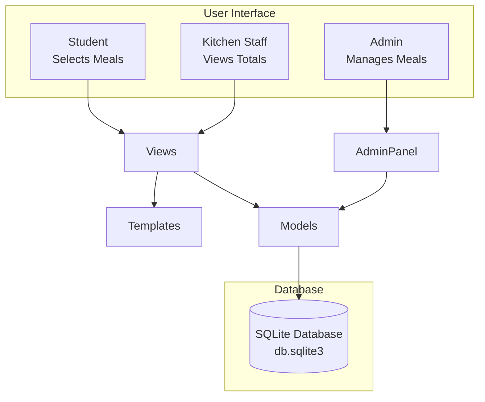

# MySchoolHub - MealsHub Module


# 🏫 Overview


MySchoolHub is the first modular of the **MySchoolHub** platform - a simple, school-friendly system that allows students (or parents) to select meals for the school week.  
It replaces manual paper-based meal choices with a clean digital workflow that reduces admin time, improves accuracy, and helps kitchen staff plan more efficiently.

MealsHub allows students to log in and choose their meals for the week, while kitchen staff receive accurate daily totals broken down by meal type and dietary requirements. This reduces manual counting, minimises food waste, and supports smoother kitchen planning. The system is designed to be clear, user‑friendly, and appropriate for a school environment.

Although this project focuses on the MealsHub module, MySchoolHub is intentionally designed to be scalable. Future modules may include attendance tracking, communication tools, and a safeguarding system similar to CPOMS (SafeGuardHub). This modular approach ensures the platform can grow over time while keeping each section focused and manageable.

---

# 🎯 Project Rationale
Many schools still rely on manual processes for collecting meal choices, which can lead to errors, delays, and unnecessary food waste. Since meals are currently free and students select their own meals, MealsHub provides a simple digital solution that:

Gives students an easy way to choose meals

Provides kitchen staff with clear, accurate totals

Reduces administrative workload

Supports dietary needs and menu planning

MealsHub forms the foundation of the wider MySchoolHub ecosystem, demonstrating how digital tools can streamline everyday school operations.

---


# 🧩 Current Features

**Student Features**

- View weekly menu
- Select **one meal per day**
- Submit all choices in one form
- "No Meal" option for each day
- Mobile-friendly layout

**Kitchen Staff Features**

- View daily totals (via Django admin for now)
- See breakdown by meal type
- Track dietary requirements

**Admin Features**

- Add/edit meals
- Set availability by day/week
- Add dietary tags (V, GF, Halal, etc)
- Manage "No Meal" option

---

# 🗂️ Database Structure

**users**

- id
- name
- email
- password
- role (student, kitchen, admin)


**meals**

- id
- name
- description
- dietary_type
- date_available

**orders**

- id
- user_id
- meal_id
- date
- created_at

---

# 🖥️ Interface Preview (Current Bahaviour)

 **Weekly Menu Page**
- Days grouped Mon-Fri
- Each day shows avaiable meals
- One checkbox per meal
- "No Meal" option included
- Student name field at the top
- One "Submit Weekly Order" button

**Order Success Page**

- Simple confirmation screen


---

# 🌱 Future Enhancements

**Parent Ordering**

Parents will be able to log in, view menus, and select meals for their children.

**SafeGuardHub (CPOMS‑Style Module)**

A secure safeguarding and behaviour logging system for authorised staff only.

Features may include:

- Logging concerns
- Recording disclosures
- Tracking follow‑up actions
- Behaviour incident history

**AttendanceHub**

Digital registers and absence tracking.

**CommsHub**

Messaging, announcements, and parent communication.

**UniformHub**

School shop for uniform orders.

---

# 🛠️ Technologies Used

- **Python** - core programming language
- **Django** - web framework for models, views, admin, and routing
- **HTML/CSS** - fromt-end structure and styling
- **SQLite** - default development database
- **Virtual environment (.venv)** - dependency isolation

---

## 🧱 Tech Stack Diagram 


---


# 📦 Setup & Installation

### 1. Create and activate a virtual enviroment

**Navigate to the project folder**

```
cd C:\Users\mosso\Documents\my_school_hub
```

**Create a virtual enviroment (only needed the first time)**

```
python -m venv venv
```

**Activate it**

```
venv\Scripts\activate
```

(You should now see (venv) at the start of your terminal prompt.)

### 2. Install project dependencies

**Once the virtual environment is active, install required packages;**

```
pip install -r requirements.txt
```

### 3. Run the application

**Start the Django development server:**

```
python manage.py runserver
```

**You should see:**

```
Starting development server at http://127.0.0.1:8000/
```

### 4. Open the local server in your browser 

**Visit:**

```
http://127.0.0.1:8000/
```

**Or go straight to the weekly menu:**

```
http://127.0.0.1:8000/menu/1/
```

### Quick Daily Workflow ###

```
cd C:\Users\mosso\Documents\my_school_hub
venv\Scripts\activate
python manage.py runserver
```

---

# 🧪 Testing
Testing will include:

Form validation

CRUD operations

Role‑based access

Meal selection logic

Totals calculation

Error handling

A full testing table can be added later.


👤 Author
Alison Mossop  
MySchoolHub — MealsHub Module